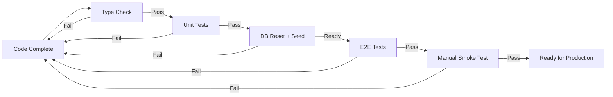

# Testing & Quality Assurance Pipeline

## Problem

Recent features (Venues, Challenges) are returning 404 errors in production, and tests aren't being run properly to catch these issues before release.

## Root Causes

1. **Test database not used in development**: When running `npm run dev`, it loads `.env` (prod) instead of `.env.test`
2. **No automated test execution**: Features are marked as complete without running E2E tests
3. **Missing test data**: `seed.sql` didn't include data for new features
4. **404 errors**: Pages require authentication/group membership that isn't tested

## Solution

### 1. Three-Tier Testing Pipeline

```
┌─────────────────────────────────────────────┐
│ Feature Implementation                 │
│   ↓                                   │
│ Type Checking  (tsc)                  │
│   ↓                                   │
│ Unit Tests    (vitest)                 │
│   ↓                                   │
│ E2E Tests    (playwright)              │
│   ↓                                   │
│ Ready for Review                         │
└─────────────────────────────────────────────┘
```

### 2. Updated Scripts

#### `npm run test` (Main Test Runner)
Runs all tests in sequence:
1. Type checking (`tsc --noEmit`)
2. Linting (`eslint`)
3. Database reset (`test:db`)
4. Unit tests (`test:unit`)
5. E2E tests (`test:e2e`)

#### `npm run test:db`
Resets test database and applies seed data with:
- Test venues (3 venues with ratings)
- Test challenges (weekly challenges, badges, streaks)
- Test players and matches

#### `npm run test:e2e:full` (New)
Runs E2E tests with proper test database:
1. Loads `.env.test` environment
2. Resets test database
3. Runs all Playwright tests
4. Generates report

#### `scripts/run-e2e-tests.sh` (New)
Convenient wrapper for running E2E tests:
```bash
./scripts/run-e2e-tests.sh
```

### 3. Environment Configuration

#### For Development (Prod DB)
```bash
# Default - uses .env
npm run dev
```

#### For Testing (Test DB)
```bash
# Method 1: Run full test suite
npm run test

# Method 2: Run only E2E tests
./scripts/run-e2e-tests.sh

# Method 3: Load test env manually
export $(cat .env.test | xargs)
npm run dev
```

### 4. Test Data in `seed.sql`

The test database now includes:

#### Venues & Ratings
- 3 test venues with full attributes
- Venue ratings from test players
- Venue analytics materialized view data

#### Challenges System
- 5 badge definitions (weekly complete, streaks, special)
- Group challenge settings
- Current week challenges (volume, performance, social)
- Player streaks
- Player weekly progress
- Earned badges for test players

#### Base Test Data
- 1 test group ("Padel Group")
- 5 test players (Fachi, Lucho, Leo, Nico, Fede)
- All relationships properly linked

### 5. E2E Test Coverage

New test files created:

#### `tests/e2e/venues.spec.ts`
Tests venue rating system:
- ✅ Venues list page loads and displays venues
- ✅ Venue detail page shows full information
- ✅ Can navigate to rating page
- ✅ Rating form has all 6 dimensions
- ✅ Can submit a venue rating
- ✅ Venue cards display correct info
- ✅ Navigation from navbar works

#### `tests/e2e/challenges.spec.ts`
Tests weekly challenges system:
- ✅ Challenges page loads and displays content
- ✅ Displays weekly challenges with progress
- ✅ Displays player streak information
- ✅ Displays weekly leaderboard
- ✅ Displays earned badges
- ✅ Navigation from navbar works
- ✅ Challenge completion status visible
- ✅ Handles no challenges gracefully

### 6. Verification Script

#### `scripts/verify-test-db.sh`
Verifies test database setup:
```bash
./scripts/verify-test-db.sh
```

Checks:
- ✅ Database connectivity
- ✅ All required tables exist
- ✅ Seed data exists
- ✅ Test group and players exist

### 7. Feature Implementation Checklist

Before marking a feature as **DONE**, verify:

- [ ] All TypeScript type errors resolved (`npm run typecheck`)
- [ ] All linting issues resolved (`npm run lint`)
- [ ] Test data added to `seed.sql`
- [ ] E2E tests created and passing (`tests/e2e/*.spec.ts`)
- [ ] Manual smoke test completed (open page in browser)
- [ ] Database migrations applied to test DB
- [ ] Feature documented in `.daily-features/`

### 8. Debugging 404 Errors

If a page returns 404, check:

1. **Authentication**: Is user logged in?
   - E2E tests handle this via `global-setup.ts`
   - Manual testing: Join group or reload page

2. **Group Membership**: Is user a member of the group?
   - Check `players` table for user's `player_id`
   - Verify `group_id` matches

3. **Group Slug**: Does the group slug match the URL?
   - Check `groups` table for the slug
   - Verify group exists in database

4. **Page Route**: Is the file in the correct location?
   - App Router: `/app/g/[slug]/venues/page.tsx`
   - Built output: `.next/server/app/g/[slug]/venues/page.js`

5. **Build Status**: Was the build successful?
   - Check `.next/` directory for compiled pages
   - Rebuild if needed: `rm -rf .next && npm run build`

### 9. Automated Testing Workflow



## Quick Start Commands

```bash
# Run complete test suite (recommended)
npm run test

# Run only E2E tests
./scripts/run-e2e-tests.sh

# Verify test database
./scripts/verify-test-db.sh

# Reset test database only
npm run test:db

# Run dev server with test database
export $(cat .env.test | xargs)
npm run dev
```

## Troubleshooting

### Issue: "404 Not Found" on pages

**Solution 1**: Check group membership
```bash
# Connect to test database
psql $DATABASE_URL -c "SELECT p.name, p.status FROM players p JOIN groups g ON p.group_id = g.id WHERE g.slug = 'padel'"
```

**Solution 2**: Verify page exists
```bash
# Check build output
ls -la .next/server/app/g/[slug]/venues/
```

**Solution 3**: Reset and reseed
```bash
npm run test:db
```

### Issue: Tests pass but page fails in browser

**Check**: Are tests using test database?
```bash
# In test file, add this check:
console.log('DATABASE_URL:', process.env.DATABASE_URL);
```

### Issue: E2E tests time out

**Check**: Is dev server starting?
```bash
# Playwright starts dev server automatically
# Check logs: npx playwright show-report
```

## Next Steps

1. ✅ Test data added to `seed.sql`
2. ✅ E2E tests created for venues and challenges
3. ✅ Verification script created
4. ✅ Test runner script created
5. ⏳ Update CI/CD to run `npm run test` before merge
6. ⏳ Add pre-commit hook to run type checking
7. ⏳ Add smoke test script for manual verification

---

**Created**: 2026-01-30
**Status**: Ready for implementation
